# Exercise 1

During this first exercise we will implement the digital output functionality of the I/O Expander.
Make sure that you have cloned the repository and checked out the branch called `exercise-starting-point`.
This should give you a folder called *source* containing a LabVIEW project file, some boilerplate code and the datasheet for the MCP23017 which we will be using.

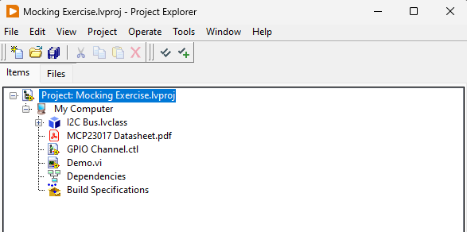

Open the LabVIEW project, which contains an abstraction for the I2C bus and the data sheet for the MCP23017.
Have quick skim through the data sheet to get familiar with the device. 
Don’t spend too much time on it, but familiarize yourself with how the device is addressed and the registers IODIRA, IODIRB, GPIOA, and GPIOB. 
We are not going to use any other registers. 

If you have never worked with an I2C bus before, just ignore the details and assume it is a bus which you may either write to or read from by giving an address. The data type of both operations is a byte array. 

## First test

We will now begin to implement the digital output functionality on port A of the MCP23017.
So in the spirit of Test Driven Development, we will begin by creating a test.
To do this, click on the New LUnit Test Case button in the toolbar and name it `MCP23017 Test.lvclass`.

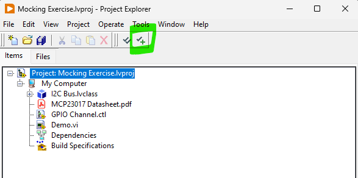

We will keep the *tests* directory on the same level as the *source* directory and the test case should be saved within the directory.

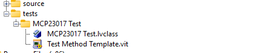

Now, create a new test method by right clicking the `Test Method Template.vit` in the project and select `New from Template`.
Save the VI and run it.
At this point the name does not matter as long as it begins with the four letters `test`. 
You should see it failing (obviously), but this is a good check to see that you have the tools setup and working.

You can also run all tests in the project from the toolbar button.

Next, let's consider what we should be testing.
Reading into the datasheet we can see that the IODIR registers IODIRA and IODIRB needs to be configured to make the pins working as outputs.
The register is a 8-bit, single byte, register and we will need to write a `0x00` to the register.

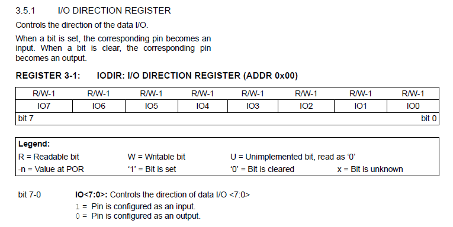

Now, how can we test this?
We can see that IODIRA is located at register address `0x00` and we will for now assume that the device uses I2C address of `0` (we'll get back to revisit this later).
So we need to verify that when initializing our driver for the MCP23017, the two bytes [`0x00`, `0x00`] are written to device address `0`.
The first of these bytes represents the register address we want to write to and the second byte is the actual data.

To achieve this, let us begin by creating a mock of the I2C bus.
Do this by right clicking the I2C Bus interface in the LabVIEW project and select `Mock...`.

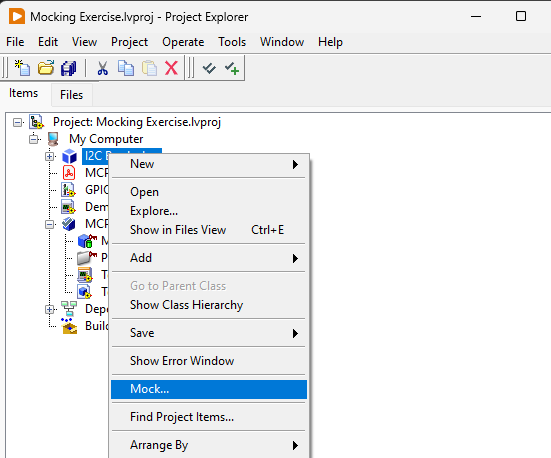

Save the test double within the tests folder using the suggested name. 
Now, we will begin to implement the test we created by using the mock class.
You will find the `Create.vi` and `Write.vi` in the generated mock class, and the `One.vi` and `Verify.vi` are both part of the LMock API and found on the pallette or using quick drop.

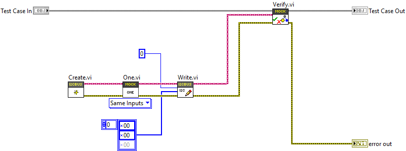

Run this test to see that the mocking framework works as expected.
You should se a failing text with a description as below.

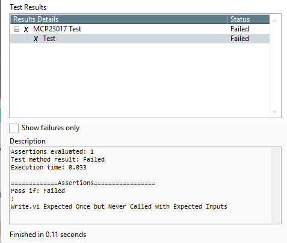

View the description reported by the mock verification and make sure you understand how this test works.
If it is unclear, please refer to the [LMock Documentation](https://lmock.astemes.com/).
The test can, of course, not pass yet as we have nothing acting on the I2C Bus, so the declared expectation cannot be fulfilled.

After some work we have finally arrived at a failing test that actually tests something useful.
Except we are not calling any of our code - we have not even written any code yet!
So lets fix that. 

Add a class the the project and call it `MCP23017.lvclass`.
Create a constructor for the class taking the `I2C Bus.lvclass` interface as an input and wire this into the test as shown below.
The constructor (Create.vi in image below) is a useful pattern to guarantee that the state of the object is valid, and it also makes finding callers of the class simple in the LabVIEW IDE.
While at it, maybe rename the test to something more meaningful, such as `Test IODIR Configured as Output on Create.vi`

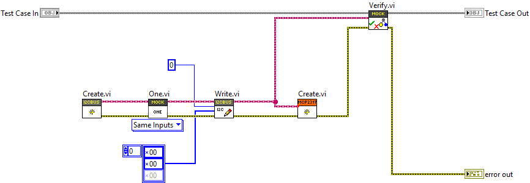

And at last we are allowed to write some actual code.
This should be trivial, so go on and make the test pass.

## Refactoring

Since we have passing test, next let's clean up what we made some. 
Refactoring is the process of making structural changes to the code without changing the behavior.
There is not a lot of code to work with, but there should be a few things we can improve.
Feel free to work the code until it is readable, but here are some ideas on what can be done about it.

- The code setting the IODIRA register would go well in a subVI with an appropriate name. This VI should be made private to the class.
- The array of bytes fed to the I2C `Write.vi` contains some magic numbers. You could replace the first byte with something more readable, such as a ring or enum.
- If you decide to create a ring representing the register address, it should be made into a private type definition of the class.
- Avoid adding more than the first one or two elements to the ring for now. We still do not know which registers we are going to address and by only adding the ones we need there is a minimal amount of code we need to change later if we change our minds.
- Also adding registers we are not yet using can make the code confusing. It turns out that IODIRA and IODIRB works analogously, but if we were uncertain we could add only IODIRA for now.
- Once you have replaced the first `0x00` with something readable, you should be able to identify a chunk of code making a nice subVI. 

The last VI would actually encapsulate a core concept, which we will leverage moving forward.
A suitable name for the VI would be `Write Registers.vi`, and this should also be private to the class.
It would look something like below.

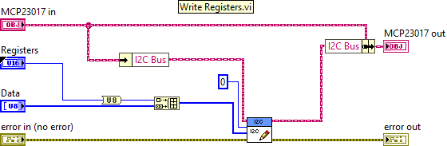

You should do the refactoring in small steps and always run all tests touching the refactored code between each change.
In this way you can be sure you are not changing the behavior.

If the above was unclear, you can always check out the `solution` branch and revert to the commit called "Refactoring after first Test".

## Addressing the Addressing Issue

Now we have managed to write the IODIRA register, but we took some shortcuts.
One thing we did was hardcode the I2C address of the MCP23017, let us resolve this.

The address of the device can be configured by pulling the address programming pins of the device either high or low.
There are three bits, allowing for 8 different addresses.
Refer to the datasheet for details, but for now it is enough to consider the figure below.

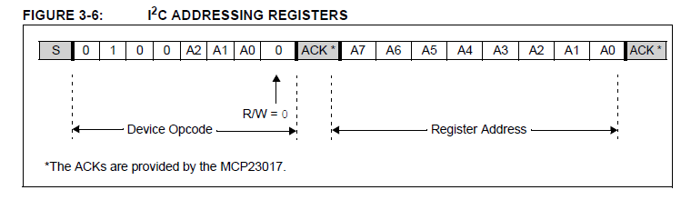

Looking at this we see that our code written earlier is actually wrong.
When the registers are all pulled low, we do not get an I2C address of 0: we get the address 0 masked with the binary number `0b00100000`.
Let's fix that by updating our first test.

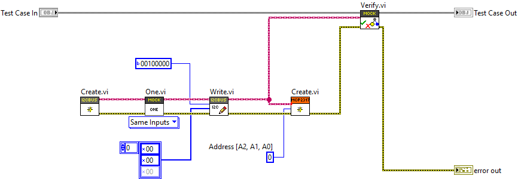

We added an input to the constructor, which feels like an appropriate place to define the address used.
We then changed the 0, which we added earlier as a placeholder, to `0b00100000`.
Now the test fails again and we should make it pass.
This should again be trivial - update the value of the constant from earlier.

Now, we still have the address hard coded (unless you did more than you needed to earlier).
To resolve this, we need to add another test showing what should happen for *e.g.* address 2.
After this you will now have two test VI:s in your test case class.
A pro-tip here is to save a copy of the previous test to save some time, as this will just be a slight variation of it.

Now we have a failing test and we need to actually use the value of the address provided to the constructor in order to make both our tests pass.
Remember, you are not allowed at any point to make an earlier test fail.
The implementation should be straight forward.
If you need help, look at the "Test 2 Passing" commit of the solution branch.
Not much refactoring to do, so let us move on to the next test.

## Controlling the Outputs

Now when we have the port configured as an output, we can start updating it by simply writing to the GPIOA register at `0x12`.
Reading the datasheet we discover that this is done similar to earlier, by first setting the register pointer and then setting the value.

As a requirement, we will assume that we want to be able to set the bits individually and not write the whole port at once.
This will impact what our API looks like and will require us to handle the state of the port somehow, but we will consider that later. 
Baby steps.

A good first test would be to set GPIOA0, which is the first bit on the A port, to 1.
We will now need to add a second public VI to our class and the API could look like below.
Feel free to use the type defined enum provided with the project to represent the GPIO channels.

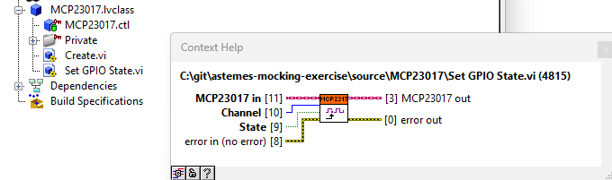

Our next test would look like below.

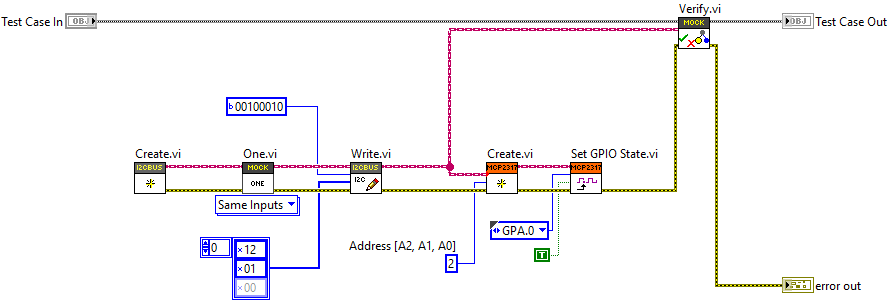

Making this test pass is again easy. 
Remember, it is okay to just use constants on the block diagram as long as all tests still pass.
Depending on how you solved it, there might be opportunity for refactoring.

Keep in mind that we already created a VI for setting a register and a type for the register address.
The type can be extended and the VI can be reused, and the result is that we have no duplication of logic.
If we would *not* have discovered the refactoring opportunity after the first test, we would likely sense it now as the logic is the same for setting the registers.

## Adding more Tests

We are able to set the first bit on the A port, but that is not good enough.
Let us add another test to set another bit.
The choice of which bit is arbitrary, but it is usually good to check edge cases. 

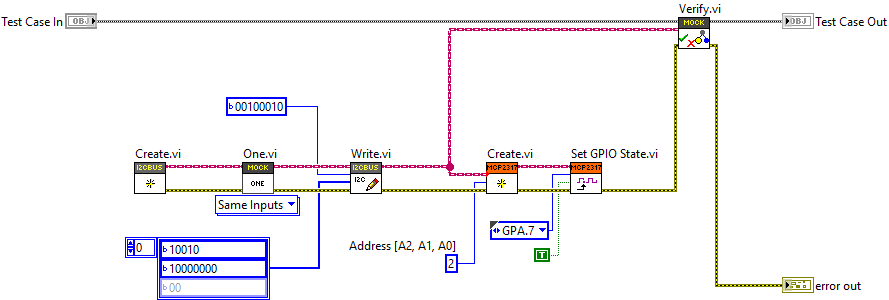

To make this pass we need to do some bit shifting, but I'm sure you will figure this one out.

The next thing to could be to write to the B port.
In this case we will get a test like below.

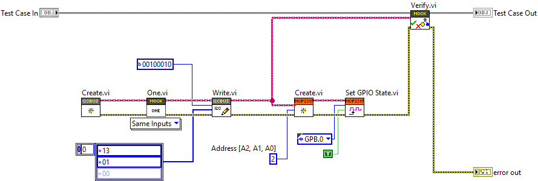

There is actually two different things making this test fail.
The register needs to be `0x13` and there will be an overflow on the byte data type setting the register.
We will need to add some kind of modulo operation to resolve this.

When you have the test passing, the block diagram is getting a bit crowded and it is good time to do some refactoring.
You could identify the "Channel to Bitmask.vi" and "Channel to Register.vi" in the "Set GPIO State.vi",as shown below.

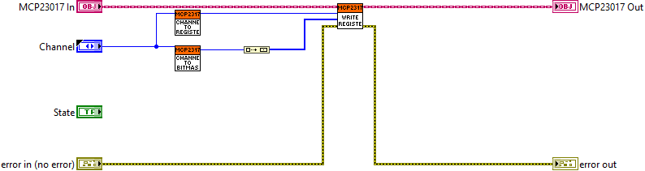

## Setting Multiple Bits

So far, so good. 
But we still have a problem.
If we were to set two bits in the same port, the second operation would undo the first.
This is shown by the test below.

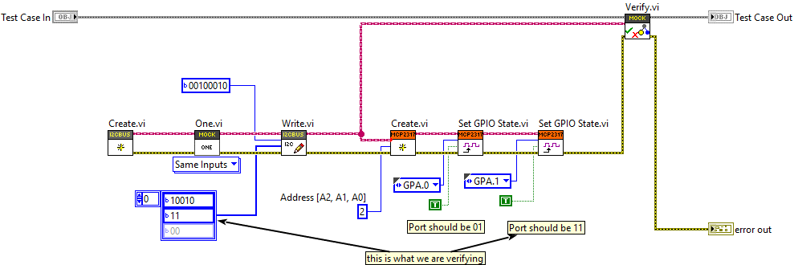

The reason it fails is  because the second write will be setting `0b10`, as it is not aware that the 0th bit should also be high.
In order to make this one pass, we will need to track the state.
The "Channel to Bitmask.vi" comes in handy.

Once you have got that one passing, there is not much left.
Except, we cannot set a bit low.
That is a bit silly, and the test below fails.

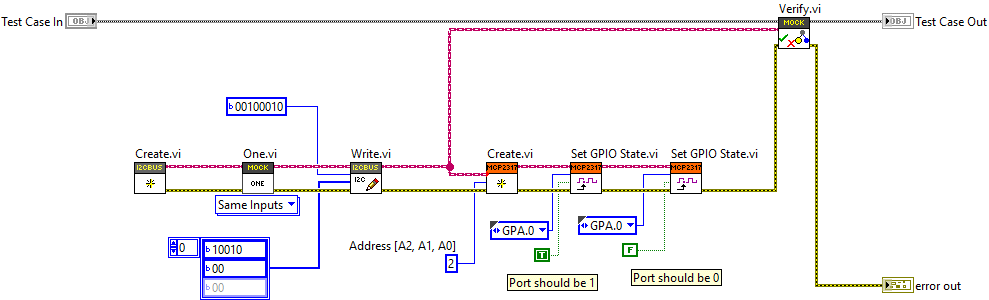

In order to make this pass, we will need to actually look at the value of the boolean `State` input to the "Set GPIO State.vi".
Once we have the test passing we can again start to consider the structure of the code and improve the readability.
By separating the calculation of the state from the call to the I2C bus, the operation handled by the "Set GPIO State.vi" may be split into two parts as below.

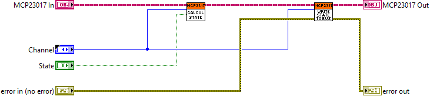

This quite readable.
And now, we only have one problem left.
We only have one state so far, but we have two ports.
So updating one port will mirror to the other, as is shown by this failing test.

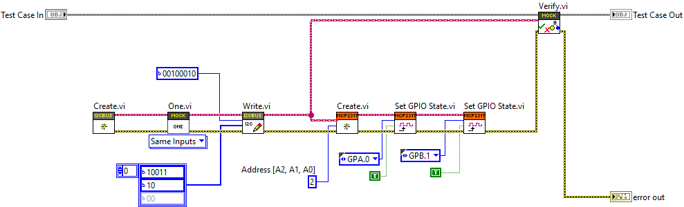

If it is not clear what failed, have a look at the failure description. 
`Address: 34(U8) == 34(U8), Data: [19, 2](U8) != [19, 3](U8), error in (no error): No Error(Cluster) == No Error(Cluster)`
The value written to the B port should have been 2 (binary `0b10`), but we got the first bit mirrored from port A.
To resolve this, you will need to make the states specific to each port.
At this point I actually decided to inline the "Channel to Register.vi", and this is normal during refactoring.
Something which made sense 10 minutes ago might not have been such a good idea after all.

## Final thoughts

At this point we have fully implemented the functionality needed to use the MCP23017 as a digital output device.
If you have the hardware setup, chances are high that you will be able to toggle a LED.
You probably did not have to do a lot of debugging, as the steps we took were so small that there should not have been much to debug.

Keeping all the previous tests passing, we could focus on adding a tiny bit of functionality, while still keeping everything working.
This allowed us to make steady progress and allowed us to focus on one piece at at time.
The design that emerged is quite clean and the code is very readable, due to our constant refactoring efforts.
When you get experienced, you are able to control the step size and adjust as you go.

As we did test every little bit of code we added, the test coverage is 100%.
Because we have seen every test fail, we can be very confident that the tests actually works and tests something useful.

This same technique works on all different levels of a software system, as well designed software is fractal in nature.
Different levels of abstraction should be separated by abstractions, through interfaces, which serves as our architectural boundaries.
These boundaries are natural seems where we can inject test doubles, but also augment the behavior of our system - without changing it.

One thing to note is that if you wanted to use the B port as output, that too would need to be configured on creation the same way we did in our first test.
I plan to continue this exercise to show how we can implement port B as an input, if there is any interest for such an exercise.